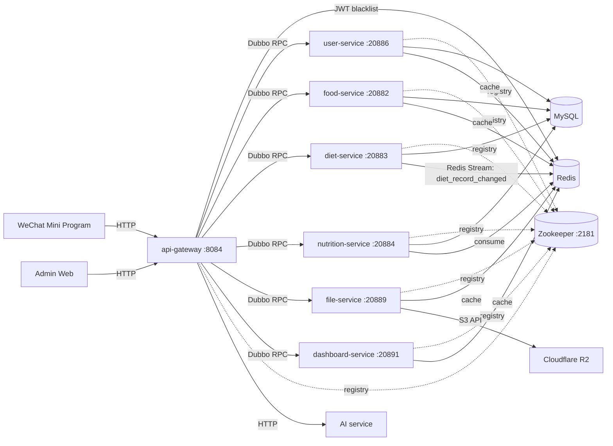

# 食刻印象（后端）

基于 Spring Boot 3 + Apache Dubbo 的饮食记录系统后端。HTTP 入口由 `api-gateway` 提供，其余服务以 Dubbo Provider 形式运行（`web-application-type: none`）。

## 技术栈（概要）

- Java 21，Maven
- Spring Boot 3.3.x / Spring Framework 6.1.x
- Apache Dubbo 3.3.x + Zookeeper（注册中心）
- MySQL 8.x（业务数据），MyBatis-Plus
- Redis（缓存、JWT 黑名单、Redis Stream）
- Spring Security 6.x + JJWT（JWT）

外部依赖（按需）：

- Cloudflare R2（S3 兼容对象存储，`file-service`）
- AI 服务（HTTP 调用，`api-gateway` 可配置）

## 环境要求

- JDK 21
- Maven 3.9+
- MySQL 8.x
- Redis 6.x+
- Zookeeper 3.7+

## 架构

## 代码结构

- `api-gateway/`: 唯一 HTTP 入口（鉴权、参数校验、Dubbo 调用）
- `user-service/`、`food-service/`、`diet-service/`、`nutrition-service/`、`file-service/`、`dashboard-service/`: 领域服务
- `*-service/*-service-api`: Dubbo 接口与 DTO（供网关/其他服务依赖）
- `*-service/*-service-app`: 领域与应用实现（Dubbo Provider）
- `shared-kernel/`: DDD 基础类型、通用响应/异常、CQRS 接口
- `observability-starter/`: 统一日志与可观测性配置封装
