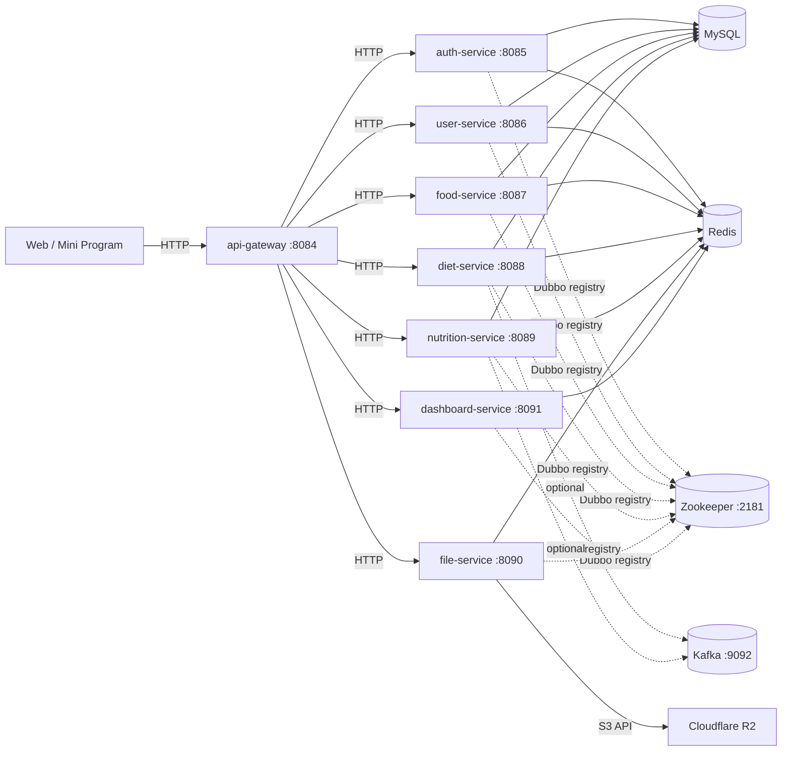

# 食刻印象（后端）

饮食记录系统的后端部分。对外统一通过 `api-gateway` 提供入口，网关负责路由转发与基础安全控制；各业务服务按领域拆分，分别提供接口与数据读写能力。

## 技术栈（概要）

- Java 8，Maven
- Spring Boot 2.7.x
- Spring Cloud Gateway（Reactive）+ Sentinel（限流/熔断）
- Apache Dubbo 3.x + Zookeeper（注册中心）
- MySQL 8.x，MyBatis-Plus
- Redis
- Kafka（可选，用于异步/事件）
- Spring Security + JWT（JJWT）

## 环境

- JDK 8
- Maven 3.6+
- MySQL / Redis / Zookeeper
- Kafka（如果启用相关事件配置）

## 架构

## 模块

- `api-gateway/`: 统一入口（路由、CORS、安全控制、限流/熔断）
- `auth-service/`: 登录与鉴权（含微信登录）
- `user-service/`: 用户与账号相关
- `food-service/`: 食物数据
- `diet-service/`: 饮食记录
- `nutrition-service/`: 营养分析
- `file-service/`: 文件服务（对接 Cloudflare R2）
- `dashboard-service/`: 后台数据聚合与统计
- `*-api-contracts/`: 各服务的契约/DTO
- `shared-kernel/`: 公共依赖与通用能力
